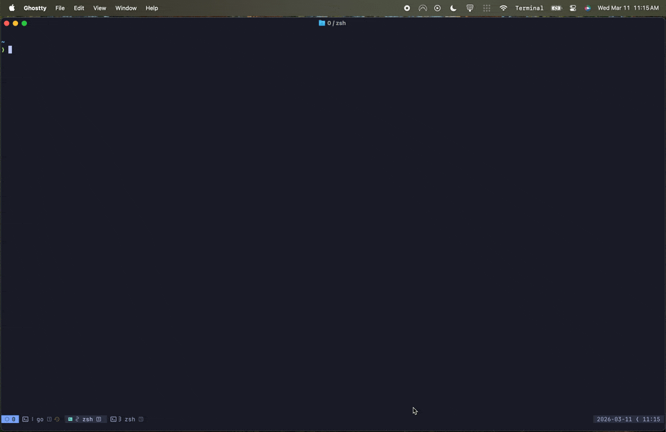

<div align="center">

# gnat

A [NATS](https://nats.io) JetStream TUI that won't bug you

[](https://github.com/galaxy-io/gnat/releases)
[](https://github.com/galaxy-io/gnat/blob/main/LICENSE)


</div>

<p align="center">
  
</p>

## Features

**Stream Management**

- Browse, create, update, delete, and purge streams
- View stream details, subjects, and message counts
- Import stream configurations from JSON
- Purge by subject

**Consumer Management**

- List, create, update, and delete consumers
- Real-time consumer lag monitoring dashboard
- Inspect consumer details and delivery state

**Key-Value Stores**

- Browse KV buckets and keys
- Get, put, and delete key-value entries
- Live watch mode for real-time change tracking

**Object Stores**

- Browse object store buckets
- Upload and download objects

**Messaging**

- Message browser with sequence-based navigation and search
- Live message monitor with configurable delivery policies
- Request/Reply tester with header support
- Pub/Sub playground for publishing messages to subjects

**Navigation & Search**

- Global fuzzy finder (`Ctrl+P`) to jump to any resource
- Command bar (`:`) with tab completion and built-in commands
- Bookmarks for quick access to frequently used resources
- JSONPath filtering for JSON message payloads

**Connection Profiles**

- Save multiple NATS server configurations
- TLS/mTLS, NKey, token, credentials file, and user/password auth
- Environment variable expansion for sensitive fields (`$MY_TOKEN`)
- JetStream domain support
- Quick profile switching with `P` key

**Customization**

- Built-in color themes (TokyoNight, Catppuccin, Dracula, Nord, Gruvbox, and more)
- Live theme preview while selecting
- Custom user commands with template variables and configurable output modes

## Installation

### From Source

```bash
go install github.com/galaxy-io/gnat/cmd/gnat@latest
```

### Brew

```bash
brew install galaxy-io/tap/gnat
```

### Build Locally

```bash
git clone https://github.com/galaxy-io/gnat.git
cd gnat
go build -o gnat ./cmd/gnat
```

## Usage

```bash
gnat                              # connects to nats://localhost:4222
gnat -profile prod                # use a named profile
gnat -url nats://nats.example.com # override server URL
```

### Command Line Flags

| Flag | Description |
|------|-------------|
| `-profile` | Connection profile name (from config) |
| `-url` | NATS server URL (overrides profile) |
| `-creds` | Path to credentials file (overrides profile) |
| `-theme` | Color theme (overrides config) |
| `-version` | Print version and exit |

### Keybindings

**Navigation**
| Key | Action |
|-----|--------|
| `j` / `k` | Navigate down / up |
| `Enter` | Select / expand |
| `Esc` / `Backspace` | Go back |
| `Tab` | Switch panes |
| `q` | Quit (from root view) |

**Global**
| Key | Action |
|-----|--------|
| `?` | Show help |
| `T` | Theme selector |
| `P` | Profile selector |
| `B` | Bookmark current resource |
| `Ctrl+P` | Fuzzy finder |
| `:` | Command mode |

### Commands

```
:streams, :s                      Streams list
:kv, :k                           KV stores
:objects, :obj                     Object stores
:dashboard, :d                    Dashboard
:monitor, :m                      Message monitor
:lag, :cl                         Consumer lag dashboard
:request, :req                    Request/Reply tester
:subjects, :subj                  Subject explorer
:playground, :play                Pub/Sub playground
:stream <name>                    Navigate to stream
:consumer <stream> <name>         Navigate to consumer
:watch <bucket>                   Watch KV bucket
:pub <subject> <data>             Publish message
:purge <stream>                   Purge stream
:bookmarks, :bm                   Show bookmarks
:profile, :p                      Switch profiles
:quit, :q                         Exit
```

## Configuration

Configuration is stored in `~/.config/gnat/config.yaml` (or `$XDG_CONFIG_HOME/gnat/config.yaml`).

```yaml
theme: tokyonight-night
active_profile: local

profiles:
  local:
    url: nats://localhost:4222

  staging:
    url: nats://nats.staging.example.com:4222
    credentials: ~/.nats/staging.creds
    tls:
      cert: /path/to/client.pem
      key: /path/to/client-key.pem
      ca: /path/to/ca.pem

  production:
    url: nats://nats.prod.example.com:4222
    token: $NATS_TOKEN
    domain: my-jetstream-domain

commands:
  stream-info:
    description: "Show raw stream info"
    cmd: "nats stream info {stream}"
    output: json
    confirm: false

bookmarks:
  - type: stream
    name: ORDERS
  - type: kv
    name: config
```

## Requirements

- Go 1.24+
- A running NATS server with JetStream enabled

MIT License - see [LICENSE](LICENSE) for details.

## Ways to Contribute

You can contribute by:

- Reporting bugs
- Proposing features or design improvements
- Improving documentation
- Fixing issues labeled good first issue

To report a bug, make a feature request, and more, visit our [issues page](https://github.com/galaxy-io/gnat/issues)

## Acknowledgments

- [NATS](https://nats.io) - The messaging system this client connects to
- [tview](https://github.com/rivo/tview) - Terminal UI library
- [jig](https://github.com/atterpac/jig) - UI component framework
